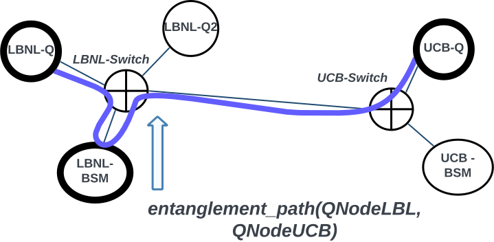

Entanglement Generation
***********************

EGP Protocol
------------
This tutorial introduces a more realistic protocol implementation for
handling user requests using
:class:`~quantnet_controller.common.request.RequestManager`
to load experiment definitions and access other plugin modules. This
protocol may be useful as a template for implementing a real link
entanglement generation protocol using the Controller's functionalities
across various plugin modules.

.. |egp-caption| replace:: **Figure 1 –** Network topology used in the EGP tutorial.

|egp-caption|

Our EGP protocol requirements are as follows:

* Allow an external client to contact the Controller using an
  ``egpRequest`` message.

* An experiment definition contains experiment sequences for each agent.

* The request message will include the following information:

  * A list of destinations (Agent IDs).
  * Minimum fidelity required for the entanglement pair.

* The client will asynchronously receive a ``responseStatus`` message
  with the results for the EGP request:

  * Return code.
  * Return message.

* The Controller will find a path between the two nodes, fetch timeslot
  availability across the involved nodes, translate the ``egpRequest``
  into agent sequences for each agent, find common timeslots among the agents,
  and populate sequences for each agent for the experiment.

With the requirements stated, you will exercise the following control
plane integrations to implement this functionality:

* Define a protocol schema for the :doc:`Message Bus<comms>`.
* Create a ProtocolPlugin for the Controller that handles external
  client requests, finds a path between the Agents, and schedules the
  experiment with RequestManager.
* Create a test client to make ``egpRequest`` calls and display results.

The complete EGP tutorial source code may be found `here
<https://github.com/quant-net/qn-plugins/blob/main/plugins/egp>`_.

Experiment Definition
----------------------
An Experiment Definition maps an Experiment name to sequences of
experiments across involved agents. It consists of three types of classes:
``Sequence``, ``AgentSequences``, and ``Experiment``.

A ``Sequence`` defines the actual sequence the agent executes at the allocated time.
``AgentSequences`` is a collection of ``Sequence`` instances for an agent to execute within the
``Experiment``.

.. code-block:: python

    class QnodeEGP(Sequence):
        name = "QnodeEGP.py"
        duration = timedelta(microseconds=1000)
        dependency = []

    class BSMnodeEGP(Sequence):
        name = "BSMnodeEGP.py"
        duration = timedelta(microseconds=2000)
        dependency = []

    class RepeaterEGP(Sequence):
        name = "RepeaterEGP.py"
        duration = timedelta(microseconds=3000)
        dependency = []

    class QnodeBlackQuantun(Sequence):
        name = "QnodeBlackQuantum.py"
        duration = timedelta(microseconds=4000)
        dependency = []

    class BSMnodeBlackQuantum(Sequence):
        name = "BSMnodeBlackQuantum.py"
        duration = timedelta(microseconds=5000)
        dependency = []

    class EGPQnodeSequence(AgentSequences):
        name = "Entanglement Generation Sequence for Qnode"
        node_type = "QNode"
        sequences = [QnodeEGP]

    class EGPBSMnodeSequence(AgentSequences):
        name = "Entanglement Generation Sequence for BSMnode"
        node_type = "BSMNode"
        sequences = [BSMnodeEGP]

    class RepeaterEGP(AgentSequences):
        name = "Entanglement Generation Sequence for Repeater"
        node_type = "RepeaterNode"
        sequences = [RepeaterEGP]

    class EntanglementGeneration(Experiment):
        name = "Entanglement Generation"
        agent_sequences = [EGPQnodeSequence, EGPQnodeSequence, EGPBSMnodeSequence]

        def get_sequence(self, agent_index):
            return self.agent_sequences[agent_index]

The ``get_sequence`` method in ``Experiment`` returns a list of ``AgentSequence`` classes in 
an order that matches the hops found from ``find_path()`` in the routing module.

Protocol Schema
---------------

Two types of messages are required for our EGP protocol:

#. The request and response from the client to the Controller.

#. ScheduleManager asks each agent for its schedule (Built-in).

#. RequestManager sends allocation messages (Built-in).

Below is the ``egpRequest`` definition. This protocol message is
intended for use as an RPC in the control plane, so it contains the
required fields ``cmd``, ``agentId``, and ``payload``. The payload
contains the request-specific fields, including ``source`` (a string),
``destination`` (a string), and ``fidelity`` (a float). ``source`` and
``destination`` must match the agent IDs registered in the Controller
for the routing module to find a path between them; otherwise, it will
fail.

.. code-block:: yaml

    EGPRequest:
      title: egpRequest
      type: object
      required:
        - cmd
        - agentId
        - payload
      properties:
        cmd:
          type: string
        agentId:
          type: string
        payload:
          type: object
          required:
            - source
            - destination
            - fidelity
          properties:
            source:
              type: string
            destination:
              type: string
            fidelity:
              type: number

Two other protocols are already built-in and are not required for a user
plugin. They may be found in the quantnet_mq YAML files located within the
`scheduler.yaml
<https://github.com/quant-net/qn-mq/blob/main/quantnet_mq/schema/rpc/scheduler.yaml>`_
and `experiment.yaml
<https://github.com/quant-net/qn-mq/blob/main/quantnet_mq/schema/rpc/experiment.yaml>`_
under the schema/rpc sub-directory.

Controller Protocol Plugin
---------------------------
With the experiment and schema definitions in place, we can now
implement the EGP protocol in the Controller. The EGP protocol is
defined as a subclass of the `ProtocolPlugin` class, enabling the
registration of handlers for commands outlined in the EGP schema.

The code for the `EGP` plugin is located in
`egp/__init__.py`. It defines a `ProtocolPlugin` instance, responsible
for processing the `egpRequest` command. Below is the full
implementation:

.. code-block:: python

    import logging
    from quantnet_controller.common.plugin import ProtocolPlugin, PluginType
    from quantnet_controller.common.request import RequestManager, RequestType
    from quantnet_mq import Code
    from quantnet_mq.schema.models import egp, Status as responseStatus, QNode

    logger = logging.getLogger(__name__)

    class EGP(ProtocolPlugin):
        def __init__(self, context):
            super().__init__("egp", PluginType.PROTOCOL, context)
            self._client_commands = []
            self._server_commands = [
                ("egpRequest", self.handle_egp_request, "quantnet_mq.schema.models.egp.egpRequest"),
                ("egpQuery", self.handle_egp_query, "quantnet_mq.schema.models.egp.egpQuery"),
            ]
            self._msg_commands = list()
            self.ctx = context

            # Initialize RequestManager with EGP schema
            self.request_manager = RequestManager(
                context, plugin_schema=egp.egpRequest, request_type=RequestType.EXPERIMENT
            )

        def initialize(self):
            pass

        def destroy(self):
            pass

        def reset(self):
            pass

        def validate_request(self, req):
            """Validate that source and destination are QNodes."""
            nodes = self.ctx.rm.get_nodes(req.payload.source, req.payload.destination)
            for n in nodes:
                if n.systemSettings.type != QNode.__title__:
                    raise Exception(f"Node {n.systemSettings.ID} is not a QNode")
            return nodes

        async def handle_egp_request(self, request):
            """Handle incoming EGP request."""
            # Create plugin-specific payload object
            egpreq = egp.egpRequest(**request)
            logger.info(f"Received EGP request: {egpreq.serialize()}")

            # Validate request
            try:
                self.validate_request(egpreq)
            except Exception as e:
                logger.error(f"Invalid argument in request: {e}")
                return egp.egpResponse(
                    status=responseStatus(
                        code=Code.INVALID_ARGUMENT.value, value=Code.INVALID_ARGUMENT.name, message=f"{e}"
                    )
                )

            # Find path between source and destination
            try:
                p = await self.ctx.router.find_path(egpreq.payload.source, egpreq.payload.destination)
                path = [str(x.systemSettings.ID) for x in p.hops]
                logger.info(f"Found valid resources: {path}")
            except Exception as e:
                logger.error(f"Could not find valid resources: {e}")
                return egp.egpResponse(
                    status=responseStatus(
                        code=Code.INVALID_ARGUMENT.value, value=Code.INVALID_ARGUMENT.name, message=f"{e}"
                    )
                )

            # Create experiment execution parameters
            parameters = {
                "exp_name": "Entanglement Generation",
                "path": p,
                # Additional experiment execution parameters can be added here
            }

            # Create Request object through RequestManager
            # Payload encapsulates the plugin request (source, destination, pairs, bellState, fidelity)
            request = self.request_manager.new_request(payload=egpreq, parameters=parameters)

            # Schedule the request for execution
            fut = self.request_manager.noSchedule(request, blocking=True)
            rc = await fut

            return egp.egpResponse(
                status=responseStatus(code=rc.value, value=rc.name, message=f"Path: {path}"),
                rtype=str(egpreq.cmd),
                rid=request.id,
            )

        async def handle_egp_query(self, request):
            """Handle EGP query for request status/results."""
            payload = egp.egpQuery(**request)
            logger.info(f"Received EGP query: {payload.serialize()}")

            try:
                rid = str(payload.payload.rid)

                # Get request with experiment result
                req = await self.request_manager.get_request(rid, include_result=True)

                if req is None:
                    raise Exception("Request ID not found")

                return egp.egpResponse(
                    status=responseStatus(
                        code=req.status_code.value, value=req.status_code.name, message=req.status_message
                    ),
                    rid=rid,
                    data=getattr(req, "experiment_data", None),
                )

            except Exception as e:
                logger.error(f"Failed to get experiment status: {e}")
                return egp.egpResponse(
                    status=responseStatus(
                        code=Code.INVALID_ARGUMENT.value, value=Code.INVALID_ARGUMENT.name, message=f"{e}"
                    ),
                    rid=rid if "rid" in locals() else None,
                )

1. **Initialization**: The `EGP` plugin is initialized with `RequestManager`. `RequestManager` tries to load experiment definition file "experiment.py" within the plugin's location.
2. **Request Validation**: The `validate_request()` method ensures all
   nodes in the request are valid quantum nodes (`QNode`).
3. **Handling Requests**: The `handle_egp_request()` method: - Validates
   the request. - Finds a path using the `router` plugin. - Creates
   parameters for the experiment, including `exp_name`, which must match
   the experiment definition name. - Schedules the experiment using the
   `RequestManager`.

The `RequestManager` translates the experiment definition into
agent-specific instructions and submits these to the agents. It
leverages the `schedule()` method of the `scheduler` plugin to handle
timing and coordination.

Client program
--------------

To test the EGP protocol, we can use the following client program:

.. code-block:: python

    import os
    import json
    import asyncio
    from quantnet_mq.rpcclient import RPCClient
    from quantnet_mq.schema.models import Schema

    async def egp_cb(res):
        try:
            ret = json.loads(res)
            print (ret)
        except Exception as e:
            print (e)

    async def do_egp(client, src, dst, fidelity):
        msg = {"source": src, "destination": dst, "fidelity": fidelity}
        req = await client.call("egpRequest", msg, timeout=20.0, sync=False)
        await req

    async def main():
        Schema.load_schema("../schema/egp.yaml", ns="egp")
        client = RPCClient("egp-client", host=os.getenv("HOST", "localhost"))
        client.set_handler("egpRequest", egp_cb, "quantnet_mq.schema.models.egp.egpRequest")
        await client.start()
        await do_egp(client, "LBNL-Q", "UCB-Q", 0.88)

    if __name__ == "__main__":
        asyncio.run(main())

- **Schema Loading**: The EGP schema is loaded to generate
  request/response models.
- **RPC Client**: An RPC client (`RPCClient`) is created to send the
  `egpRequest` command and handle responses asynchronously.

Execution Example
-----------------
Running the client with `LBNL-Q` as the source and `UCB-Q` as the
destination, with a fidelity of 0.88, returns the following:

.. code-block:: bash

    $ python3 test_egp.py 
    {'status': {'code': 0, 'value': 'OK', 'message': "['UCB-Q', 'UCB-SWITCH', 'LBNL-SWITCH', 'LBNL-BSM', 'LBNL-SWITCH', 'LBNL-Q']"}}

Controller logs for this request:

.. code-block:: bash

    2025-10-30 21:25:45,429 egp                           7703     INFO Received EGP request: {"cmd": "egpRequest", "agentId": "egp-client", "payload": {"source": "LBNL-Q", "destination": "UCB-Q", "pairs": 1, "bellState": "11", "fidelity": 0.88}}
    2025-10-30 21:25:45,568 egp                           7703     INFO Found valid resources: ['LBNL-Q', 'LBNL-SWITCH', 'LBNL-BSM', 'LBNL-SWITCH', 'UCB-SWITCH', 'UCB-Q']
    2025-10-30 21:25:45,622 quantnet_controller.common.request 7703     INFO Created new request f358e30aa24a4ec38a84d314fe3f0f1d of type RequestType.EXPERIMENT
    2025-10-30 21:25:45,839 quantnet_controller.common.request_translator 7703     INFO Loading experiment Entanglement Generation
    2025-10-30 21:25:45,840 quantnet_controller.common.request_translator 7703     INFO Visualizing Experiment detail

    ----------------------------------------
    Entanglement Generation translates to:

    Entanglement Generation sequence for Qnode for an agent with sequences:
    experiments/dds_output.py - duration: 1000.0 ms

    Entanglement Generation sequence for Qnode for an agent with sequences:
    experiments/dds_output.py - duration: 1000.0 ms

    Entanglement Generation sequence for BSMnode for an agent with sequences:
    experiments/dds_output.py - duration: 2000.0 ms
    ----------------------------------------

    2025-10-30 21:25:45,841 quantnet_controller.common.request_translator 7703     INFO Found agents [<Literal<str> LBNL-Q>, <Literal<str> UCB-Q>, <Literal<str> LBNL-BSM>]
    2025-10-30 21:25:45,900 quantnet_controller.common.request_translator 7703     INFO Agent LBNL-Q is ready.
    2025-10-30 21:25:45,960 quantnet_controller.common.request_translator 7703     INFO Agent UCB-Q is ready.
    2025-10-30 21:25:46,016 quantnet_controller.common.request_translator 7703     INFO Agent LBNL-BSM is ready.
    2025-10-30 21:25:46,017 quantnet_controller.common.request_translator 7703     INFO translating request: f358e30aa24a4ec38a84d314fe3f0f1d
    2025-10-30 21:25:46,017 quantnet_controller.common.request_translator 7703     INFO Handling timeslots for agents
    2025-10-30 21:25:46,017 schedule_manager              7703     INFO Fetching timeslots from agents [<Literal<str> LBNL-Q>, <Literal<str> UCB-Q>, <Literal<str> LBNL-BSM>]
    2025-10-30 21:25:46,017 schedule_manager              7703     INFO getting schedule from LBNL-Q
    2025-10-30 21:25:46,020 schedule_manager              7703     INFO getting schedule from UCB-Q
    2025-10-30 21:25:46,020 schedule_manager              7703     INFO getting schedule from LBNL-BSM
    2025-10-30 21:25:46,041 quantnet_controller.common.request_translator 7703     INFO Finding common timeslots from agents [<Literal<str> LBNL-Q>, <Literal<str> UCB-Q>, <Literal<str> LBNL-BSM>]
    2025-10-30 21:25:46,044 quantnet_controller.common.request_translator 7703     INFO timeslots: [0]
    2025-10-30 21:25:46,044 quantnet_controller.common.request_translator 7703     INFO Submitting sequences experiments/dds_output.py to LBNL-Q with slot [0]
    2025-10-30 21:25:46,044 quantnet_controller.common.request_translator 7703     INFO timeslots: [0]
    2025-10-30 21:25:46,044 quantnet_controller.common.request_translator 7703     INFO Submitting sequences experiments/dds_output.py to UCB-Q with slot [0]
    2025-10-30 21:25:46,044 quantnet_controller.common.request_translator 7703     INFO timeslots: [0]
    2025-10-30 21:25:46,044 quantnet_controller.common.request_translator 7703     INFO Submitting sequences experiments/dds_output.py to LBNL-BSM with slot [0]

- The `scheduler` identifies timeslots for agents and coordinates the
  experiment.
- The `schedule_manager` translates the experiment into sequences and
  submits them to agents for execution.

This concludes the implementation and testing of the EGP protocol.