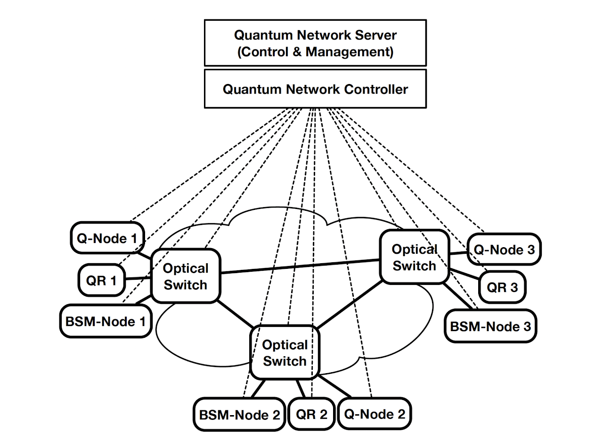
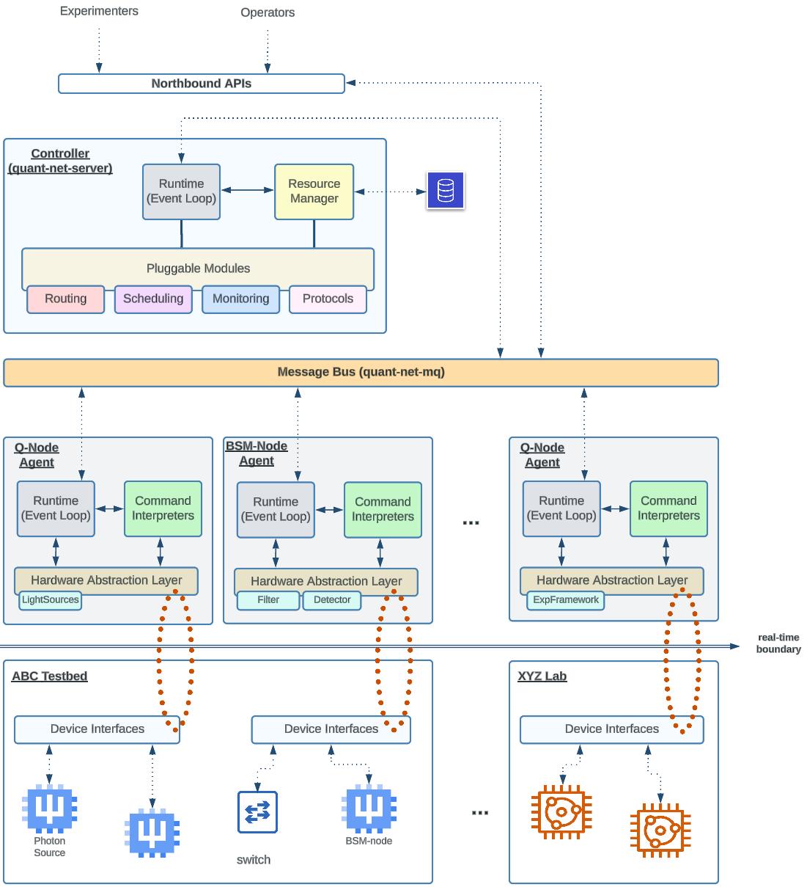

QUANT-NET Control Plane
#######################

The QUANT-NET Control Plane provides a software framework for expressing and managing quantum network resources. It may be used to orchestrate a physical quantum testbed with real device driver implementations, or it may be used as a proving ground when developing new protocols and management functions. In practice, both approaches may be useful when undertaking research and development in emerging quantum testbeds. 

The framework has been designed to provide extensible, modular capabilities that include scheduling, routing, monitoring, and protocols. A number of reference implementations in each module category have been included in the installable packages; however, the intent is that each of these modules may be extended or re-implemented to meet the needs of the particular deployment or research need.

Background
**********

Funded by the Advanced Scientific Computing Research (ASCR) division of the U.S. Department of Energy’s Office of Science, the Quantum Application Network Testbed for Novel Entanglement Technology (QUANT-NET) project is a collaboration between Lawrence Berkeley National Laboratory (Berkeley Lab), University of California, Berkeley (UC Berkeley), the California Institute of Technology, and the University of Innsbruck to construct a testbed for quantum networking technologies. 

As part of the testbed construction and operation effort, the project team has developed a quantum network control architecture and protocol stack known as the QUANT-NET Control Plane, which is documented here. More information about the QUANT-NET project may be found at: https://quantnet.lbl.gov/

Network model
*************

In QUANT-NET, we consider a quantum network that can support multiple concurrent users and multiple quantum nodes. Essentially, the quantum network consists of four major types of quantum entities as shown in the figure below:

* Quantum end nodes (Q-nodes) 
* Quantum repeater (QRs). 
* Bell-State-Measurement nodes (BSM-nodes).
* Quantum channels.

Q-nodes, QRs, and BSM-nodes are connected to optical switches through optical fibers. The optical switches are further connected among one another to form a meshed all-optical network. Dedicated wavelengths of these fibers are used as quantum channels to transmit quantum signals between Q-nodes, QRs, and BSM-nodes. Through dynamic provisioning, multiple logic quantum networks can be generated from the same underlying physical network. 

Software Components
*******************

The QUANT-NET control plane is deployed as a distributed system. A centralized :doc:`Controller </server>` coordinates with multiple distributed :doc:`Agents </agent>` that communicate using a shared :doc:`Message Bus </comms>`.

The Controller package includes a :doc:`plugin </plugins>` interface to support the addition of custom modules. The Agent package includes the concept of extensible command :doc:`interpreters </interpreters>`, which define the behavior of the Agents when processing protocol messages and interacting with the underlying hardware or simulation devices.

A hardware abstraction layer (:doc:`HAL </hal>`) defines a base set of hardware classes for managing the interaction with quantum devices and external experiment control frameworks.

