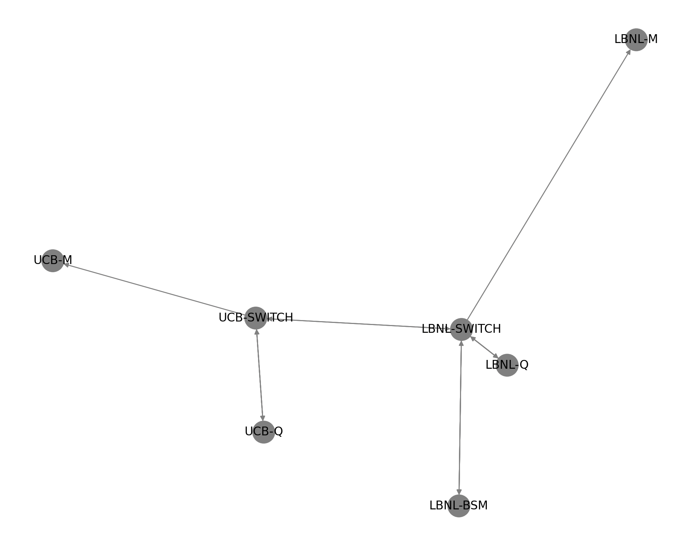
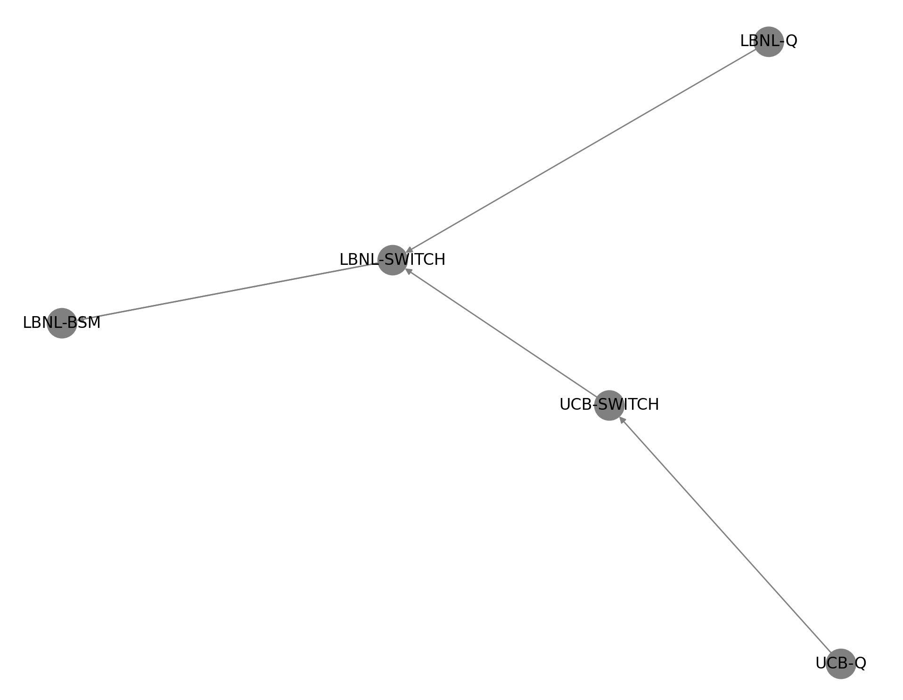

============================
Routing Module
============================

The :doc:`Controller </server>` acts as the central component for managing quantum network routing across the QUANT-NET testbed. It provides an interfacefor routing plugins, which enable dynamic routing capabilities through customizable handlers for processing network routing messages. 
This interface is designed to be extensible, allowing developers to implement their own routing logic to suit diverse network requirements.

Routing Plugin Interface
-------------------------
To create a custom routing solution, a routing plugin must implement the 
``find_path()`` method. This abstract method takes two primary arguments:

- ``src``: the source node in the network
- ``dst``: the destination node

When invoked, ``find_path()`` is expected to return an optimized route between these nodes, enabling efficient data transfer across the quantum network. 
The interface also allows for additional methods, giving plugin developers the flexibility to introduce more sophisticated routing mechanisms, such as adaptive or constraint-based routing algorithms, specific to quantum networks.

Built-in Routing Plugin
-----------------------
The Controller includes a built-in routing plugin for streamlined routing within the QUANT-NET network. This default plugin performs two primary actions:

1. Topology Retrieval: It queries the :doc:`Controller </server>` resource manager to gather the latest network topology. This topology data contains essential information about network nodes, links, link capacities, and any current network conditions or constraints. Access to up-to-date topology ensures the routing decisions reflect the current state of the network.

2. Pathfinding Execution: Once the topology data is retrieved, the plugin invokes the ``"routing"`` module, a dedicated component designed to handle the pathfinding process. The routing module uses algorithms optimized for quantum network topologies, which may differ significantly from classical routing due to the unique constraints of quantum nodes and link properties.

Routing Module Details
-----------------------
The "routing" module is designed to support various algorithms, such as shortest-path or custom metrics, considering quantum-specific parameters like entanglement fidelity, decoherence rates, and link stability. By enabling a modular approach, developers can tailor pathfinding to account for these quantum-specific characteristics, potentially increasing the success rate and reliability of quantum transmissions.

This structure not only enables the Controller to support a range of routing scenarios within the QUANT-NET testbed but also facilitates future expansion with new routing plugins, ensuring flexibility and scalability in a rapidly evolving quantum networking environment.

Examples
--------

We present results of using this routing module to identify paths between ``UCB-Q`` and ``LBNL-Q`` on the ``QUANT-NET`` Testbed network.

    
    Figure 1. QUANT-NET Testbed Network Topology
    
    
The routing module generates the entanglement graph.

    
    Figure 2. Generated Engtanglement Graph

The results from the default shortest path algorithm and the one with entanglement constraints ::    

	Shortest Path hop by hop: ('UCB-Q', 'UCB-SWITCH', 'LBNL-SWITCH', 'LBNL-Q')
	Entanglement Path hop by hop: ['UCB-Q', 'UCB-SWITCH', 'LBNL-SWITCH', 'LBNL-BSM', 'LBNL-SWITCH', 'LBNL-Q']