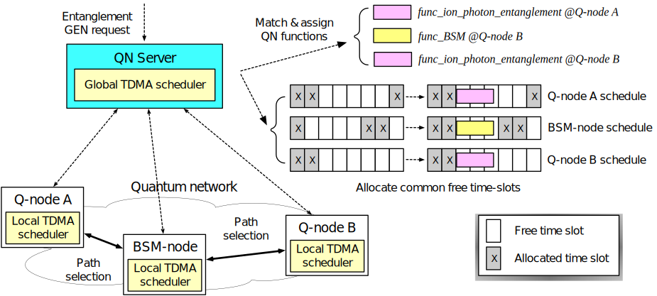

============================
Scheduling Module
============================

Two-level scheduler
------------------------------

Network level
~~~~~~~~~~~~~~
The :doc:`Controller </server>` has a global scheduler to handle network-wide
(global) non-real-time functions such as quantum network topology
discovery, quantum network monitoring, and quantum link calibration etc.
The controller also handles user requests on an event-driven basis. When
serving a user request, the controller performs alternating cycles between
calibration and operational mode. 

Node level
~~~~~~~~~~~
Each :doc:`Agent </agent>` implements a node with dedicated real-time control system.
Each node has a local scheduler to handle node-wide (local)
real-time functions that have tight time constraints, such as qubit
control and quantum protocol implementation etc.

User request handling
---------------------

    
    Figure 1. User request handling in two-level scheduler

When a user requests an QN request, controller orchestrate the request
handling in following order.

1. The controller performs a request analysis. The request is admitted
   only if its requirement can be fulfilled. 
2. If the request is admitted, the controller proceeds to call a
   routingroutine to select a path to establish entanglement. 
3. The controller matches and assigns functions required for remote
   entanglement generation for each node along the path. We assume a
   singlefunction is required at each node, which are
   *func_ion_photon_entanglement* at Q-node A, *func_BSM* at BSM-node,
   and *func_ion_photon_entanglement* at Q-node B, respectively. The
   control framework has full knowledge of these functions, which are
   well-characterized and pre-configured.
4. The controller reaches out to Q-node A, BSM-node, and Q-node B for the
   time-slot allocation status of their local schedulers.
5. Q-node A, BSM-node, and Q-node B all reply with their local
   schedules.
6. The controller proceeds to call the network-wide scheduler to allocate
   common free time-slots for *func_ion_photon_entanglement* at Q-node
   A, *func_BSM* at BSM-node, and *func_ion_photon_entanglement* at
   Q-node B, such that these functions can be scheduled simultaneously
   at time T1. Afterwards, the controller updates Q-node A, BSM-node, and
   Q-node B with the newly assigned time-slots.
7. Q-node A, BSM-node, and Q-node B accept and confirm the newly
   assigned time-slots.
8. At time T1, the local schedulers run
   *func_ion_photon_entanglement* at Q-node A, *func_BSM* at BSM-node,
   and *func_ion_photon_entanglement* at Q-node B, respectively.

Calibration handling
--------------------

.. figure:: _static/dependency_handling.svg
    :scale: 60%
    :align: center
    
    Figure 2. Dependency handling using a DAG

When an Agent starts, its node-level scheduler manages local calibration
tasks as defined in the agent's configuration file. This ensures that
real-time devices remain calibrated and ready for incoming tasks. To
manage these calibration tasks, the agent reads the task section of its configuration file:

Example: ::

   [tasks]
   [[light_calibration]]
   path=dummy_lsrc_calibration.py

   [[light_calibration2]]
   path=dummy_lsrc_calibration.py

   [[cavity_calibration]]
   path=dummy_cavity_calibration.py

With the task definitions, it performs the following steps:

1. Each constructs a Directed Acyclic Graph (DAG) with an empty
   root node, based on the local calibration definitions from the
   configuration file. This DAG is used to track task dependencies. Each
   non-root node represents a calibration task, while the edges between
   nodes represent dependencies. Tasks with no dependencies are
   connected directly to the root node via an edge.
2. The DAG is traversed using a Breadth-First Search (BFS) algorithm,
   and tasks are scheduled in the agent's local schedule in the order
   they are encountered.
3. Initially, the state of all nodes is set to *OUT_OF_SPEC*. The DAG is
   periodically traversed using BFS to check the state of each node. If
   a calibration task is valid (i.e., it was performed correctly within
   the specified interval), the node’s state is updated to IN_SPEC. If a
   calibration task becomes invalid, the task and all its predecessors
   are set to *OUT_OF_SPEC*.
4. If the root node’s state changes between *IN_SPEC* and *OUT_OF_SPEC*, the
   agent sends a monitoring message to the controller to report the
   status change.
